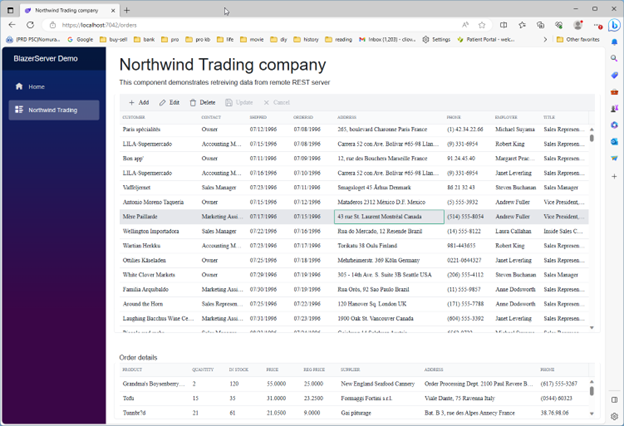
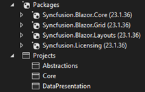

# Blazor Demo project. Step by step



The BlazorServer demo project demonstrates the way to utilize the Platform-Product architecture to create a Blazor UI Web application with virtually no code-behind. 

The use of injected ViewModel, implemented in the DataPresentation assembly of the Domain layer, lets Blazor developers concentrate on css, razor, cshtml and js code, without ever being engaged in data processing or error handling aspects.

The platform allows UI application to be made 100% unit-testable as well.

## Creating BlazorServer project step by step

1.	In Visual Studio 2022, create Blazor Server project Clio.Demo.BlazorServerXXX. Namespace renaming is problematic in Blazor, so name should be set upfront
  * Configure for HTTPS
   * .Net 7.0
* Do not use top level
3.	Add references:
   
   
   
3.	Modify Program.cs. 
* Create class derived from WebBlazorAppHost master class
* In Main call Run() on new instance of your class 
* Override addAppServices(). Add Syncfusion licensing provider key
* Temporarily place AddSingleton<WeatherForecastService>(); into addAppServices()
       * Run application, make sure all pages work
  
    ```C#
    public class Program
    {
        static async Task Main(string[] args)
        {
            await new BlazorDataServer().Run(args);      // Middleware pipeline logic is encapsulated in a Master class
        }
    }

    public class BlazorDataServer : WebBlazorAppHost
    {
        protected override void addAppServices(IServiceCollection services)
        {
            _services = services;                        // capture a reference to container for inspection
            
            services.AddSingleton<NorthwindGateway>();   // gateway to WebAPI server, injected into ViewModel
            services.AddSingleton<NorthwindViewModel>(); // ViewModel is to be available for injection into razor components
            
            services.AddSyncfusionBlazor();
            SyncfusionLicenseProvider.RegisterLicense("Ngo---Xko=");  // In non-demo solutions, the key is to be stored with other secrets
        }
    }
    ```

5.	Add ‘Northwind’ section to appsettings.json. Address:XXXX:4211 Route:api/orders
6.	Modify Razor pages
	In Shared/NavMenu.razor, remove div for ‘Counter’ page.
* Run app to see two pages still available
* Add new razor page (component) ‘Orders’ to Pages. Hook new page to the components defined in Domain assemblies Data and DataPresentation:
      a.	Page name
      b.	Set ‘usings’
      c.	Inject viewModel;
  
      ```Razor @page "/orders"
      @using Clio.Demo.Data.Northwind;
      @using Clio.Demo.DataPresentation.Elements;
      @using Clio.Demo.DataPresentation.Gateway;
      @using Clio.Demo.DataPresentation.ViewModel;
      @using Syncfusion.Blazor.Grids;
      @inject NorthwindViewModel viewModel; 
      ```
      d.	Set headers
      e.	Add (commented out for now) SFGrid markup code for master and detail grids
      f.	Add code section with viewModel.Initialize() and RowSelectEventArgs event handler
      Change page name in Shared/NavMenu.razor. Application should still run, ‘Fetch data’ tab showing new (empty) ‘Orders.razor’ page
    ```C#
    protected override async Task OnInitializedAsync()
    {
        await viewModel.Initialize();
    }

    public void RowSelectHandler(RowSelectEventArgs<OrderElement> Args)
    {
        viewModel.SelectedIndex = Args.Data.OrderID;
    }
    ```
8.	Remove and modify Visual Studio generated code: 
* Exclude Data folder from project
* Remove singleton for WeatherForecastService in Progrem.cs 
* In Shared/NavMenu.razor, replace tab name with ‘Northwind Trading’. Replace app name with ‘BlazorServer Demo’
* In Pages/Index.razor, put ‘Clio Research Inc.’ and ‘About us’. 
* Delete Pages/Fetchdata.razor and Pages/Counter.razor. App should run, displaying ‘Orders’ page
* Clean Shared/MainLayout.razor
9.	Add style sheets for Syncfusion components
* Copy two tailwind*.css files into wwwroot\css
* Copy link to css/tailwind-blazor.min.css as well as Syncfusion Javascript references into /head element of Pages/_Host.cshtml
10.	Uncomment SFGrid markup in ‘Orders.razor’. 


The DataContext(s) in grid controls `SfGrid<OrderElement>` GridOrders and `SfGrid<DealElement>` GridDeals are bound to observable collections, which are defined and maintained by NorthwindViewModel class (in DataPresentation assembly). The same view model also maintains relationship between collections, facilitating Master-Detail grid functionality.

The majority of C# code and testing harnesses are implemented in Domain assemblies, outside of Blazor server UI project. There is virtually no code-behind.

Once razor component executes `OnInitializeAsync()`, both grids are populated with data. View model receives data from Web API server (running on separate workstation). View model uses NothwindGateway class for API connectivity. 


