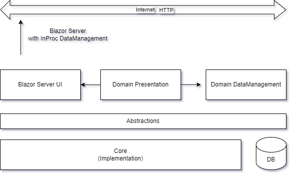

# 'Clean Architecture’ concept, implemented.

  - [The Demo solution](#the-demo-solution)
  - [Solution structure](#solution-structure)
  - [Blazor server transition: From monolith to modular](#blazor-server-transition-from-monolith-to-modular )
  - [Blazor server API consumption: Remote or InProc](#blazor-server-api-consumption-remote-or-inproc)
  - [Code metrics](#code-metrics)
  - [The implementation patterns](#the-implementation-patterns)

The first article in this series was written to make a case for extending the concept of 'Clean Architecture'. 

https://github.com/SergeyKarpov914/Asp.PlatformDemo/blob/master/Docs/CleanArchitectureStudy.md

In that article I have outlined a software solution architecture, which has many aspects in common with concentric view of a ‘Clean Architecture’, but also emphasizes the importance of dependency upon an abstraction representation of the pattern implementations, as well as flexible assembly packaging. The extended version of ‘Clean Architecture’, which I prefer to call a ‘Platform-Product’ architectural pattern

I figured it would be nice to demonstrate the feasibility of the architecture in a functional Asp.NET Core solution. 

## The Demo solution

Even though a few professional systems have been developed based upon ‘Platform-Product’ architecture, that code cannot be used for public demonstration purposes. 

To showcase the pattern, I have developed a C# solution under the name of AspDotNetDemo, which resides in a public demo GIT repository and consists of projects (assemblies) representing the key elements tagged in the ‘Platform-Product’ architectural diagram. Solution is built on .Net 7 runtime on top of Microsoft Asp.NET Core platform.

> It is worth pointing out that I’m not in the business of publishing tutorials. The solution presented cannot be considered as a ‘How to’ guide, and the code is written for demonstration only.
The implementation code in the demo solution is simplified and shortened in comparison with the real production code. Some of the important patterns implementations is omitted all together.

## Solution structure

The Demo solution structure matches the main architectural Platform-Product model virtually one to one and can be used as a feasibility study of the architecture.
The solution is structured vertically, along the dependency lines. The projects depend on the ones higher in the hierarchy, and never vice versa. The solution folder numbering forces the VS2022 Solution Explorer sorting and helps to visualize the dependency direction.

-	**Abstractions** the top-most folder belongs to Platform and contains interfaces and primitive data types. Most of the interfaces represent abstract view at the main implementation solutions provided by the Platform 
*	**Core** the second folder belongs to Platform and depends on Abstractions. It contains pattern implementations. In the compete version of Platform implementation, Core typically contains comprehensive implementation of the main solution patterns and is distributed as multiple assemblies, allowing Product designers to use only patterns they need.
*	**Data** belongs to Domain part of the Product. It holds domain entity definitions. In case of Demo solution, these entities correspond to the tables in the Northwind database.
*	**DataManagement** belongs to Domain part of the Product. It implements data-related business logic.
*	**DataPresentation** belongs to Domain part of the Product. It encapsulates presentation business logic. This project is used in Blazor and WPF applications, built on top of the Platform.
*	**API** folder belongs to Product. It is the first corresponding to the outer application layer on the main architectural diagram. In Demo solution, this folder contains a server project, which exposes WebAPI for manipulating the data in the Northwind database.
*	**UI** folder belongs to Product. It is the second corresponding to the outer application layer on the main architectural diagram. In Demo solution, this folder contains a client UI project, which consumes the server API using HTTP connection.
+	**Test** project belongs to the Platform and holds unit tests. The Platform is designed to be completely self-testable. The tests are gradually accumulated until (almost) 100% of code coverage is reached.

The UI folder in the solution contains three projects, representing some of the UI technologies which are most used at present:

1.	Console application. Constructed with Asp.NET Core application Host and a Hosted Service
2.	Blazor Server (Web) application. Asp.NET Core application interacting with a web UI via SignalR 
3.	WPF Windows application. Represents the most popular desktop UI application technology (to be implemented)

There also is an API folder, where I have placed an Asp.NET Core WebAPI Server application.

These components represent the top outer layer in Platform-Product architectural diagram.

## Blazor server transition: From monolith to modular  

The Blazor Server project can be used as a very clean illustration of the difference between Monolith and Modular implementation styles.

Once a project is created from VS2022 template, you get all-in-one kind of implementation. It has it’s own Domain Entities, embedded Data Base, Data access component and Razor components with the code-behind which handles all interactions between visual elements and underlying data.

The application works and it is even more or less compliant with the ‘Clean Architecture’.

I have made a little guide for myself, specifying the steps which need to be taken to transform this simple Blazor application into one which takes advantage of a separate Platform and separate Domain layer.

https://github.com/SergeyKarpov914/Asp.PlatformDemo/blob/master/Docs/BlazorServerDemoStepbyStep.md

## Blazor server API consumption: Remote or InProc?

Interesting design dilemma can be also illustrated by the Blazor Server project.

Do we need a separate API server when creating a Blazor server? And if not, what is the alternative?

My Blazor server provides CRUD access into a SQL database. When a random Web UI is created, which needs to provide a CRUD functionality, it usually configured in conjunction with a Web API (REST) Service, which sits on a SQL database in question.  A Web UI communicates with REST service using asynchronous HTTP client, everything works well and everybody is happy.

That is exactly how I have implemented my Blazor UI.

Both client and server are consuming the abstractions exposed by the Platform, both are using the same Domain logic and data. I run server on one workstation, UI on another, everything works like a charm.

But is this a good design? No, it is not. 

The reason I created a separate WebAPI server and a separate Blazor UI, is simply because I wanted to demonstrate them both together. Demonstrate two working components, instead of one at a time.

In fact, Blazor server UI is itself a server. Providing appropriate deployment topology, it doesn’t need another server to communicate with a database. Here is what the design should of look like:

Blazor UI is still consuming the API provided for communication with a database. But it is doing so InProc. Without separate server process, controller and HTTP communication.

The fact that I can easily re-configure my UI project to use Domain Management module remotely or in proc, speaks volumes about the Platform-Product architecture. Every module is self-contained and self-tested. A system can take advantage of all the available modules, both in Platform and in Domain.

## Code metrics

Here are the figures showing how big (or small) the Demo implementation is, and how much code a producer of a Product has to create, if there is a proper Platform available.

> I have artificially increased the number of code lines for DomainManagement and DomainPresentation, because the demo complexity of these modules is not very realistic.

The metrics show that Platform covers more than 50% of the code for an application. This code is already written by the time Product development starts. 

Another 20-35% are implemented within Domain modules, which are typically shared between related Products. 

The remaining percentage is left for the code specific for a Product.

In real systems, bespoke product and domain code share will be different. And even then, in a process of writing bespoke code, the developers will be noticing generic patterns, which can be pushed up into Domain and Platform. 

## The implementation patterns

The purpose of existence of Platform is to implement common patterns. Pattern implementations are designed, refined, tested and exposed for injection.  

Pattern implementation and refinement is a perpetual process which takes place independently of the usage of a Platform. As long as abstractions remain consistent, the backward compatibility of pattern implementation should be preserved.

Ideally, there are periodic Platform upgrades, which are done on the dependent Products.

Here is the list of patterns for Asp.NET Core based systems. Most of them already have implementation in the Platforms which are in production or under development. The other wait for their turn.

