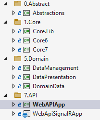
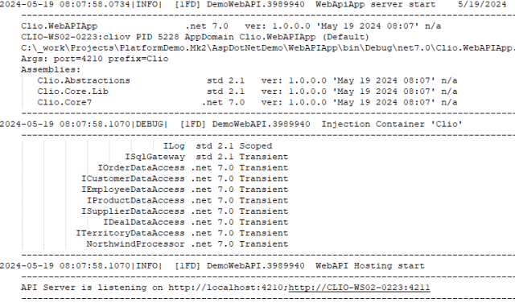
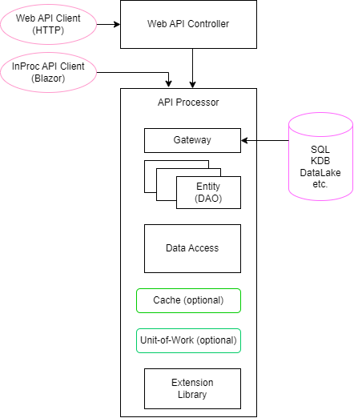

# ASP Demo platform

The demo platform code was written in the early summer of 2023. It is a simplified demo version showcasing the general design and coding style used in couple of commercial projects.  

The platform is a collection of .NET assempblies which is used to build custom CRUD-type API servers and Blazor Web UIs. 
All common code is incapsulated into the platform. Building a custom solution using such platform presents two main advantages:

1. It helps to conduct rapid development, because most of the code is already there. 
2. It helps to achieve high reliability, since platform code is comprehensively tested.


## Solution structure

Platform solution structure shows three groups of assemblies:





1. Core assemblies which include all interfaces, patterns, core class structures and extensions.
2. Domain assemblies which represent custom data and logic used accross applications.
3. Applications.

The assemblies from the Core group are present in every solution built on top of the platform. The assemblies from the Domain group represent custom dependencies and are injected into a custom solution at runtime.

At the application start, the static and injected assemblies are caprured in the log: 




## Code annotation

Let us take a look at the WebAPI CRUD server application. 

The centerpiece of server is an API processor. Processor can be used by an API controller, when server is responding to HTTP calls, or it can be used InProc, as a part of Blazor server implementation.



All components shown (except for optional cache and unit-of-work) are instrumental for the functionality of the demo platform. 
For code annotation I picked one of the most interesting components: DataAccessMaster core class.

The code of DataAccessMaster utilizes such .Net features as Generics and generic constraints, read-only data members, constructor dependency injection.

The design involves custom ORM implementation in form of SQL gateway and IEntity DAO definition, async-await technique and a propriatery version of Template function pattern, also know as 'Visiting professor'.
The public entry points can use default implementation, or can be customized by using protected override methods implemented by derived cless. 

The exception handling is provided at the public level only. The design rule 'private throw, public catch' is used.

There is no interim returns from any method. The return data variable is always declared at the entry point of a method and is returned at the exit point.

  
   ```cs

        namespace Clio.Demo.Core7.Pattern
        {
            public class DataAccessMaster<T> : IDataAccess<T> where T : class, IEntity, new()
            {
                #region c-tor

                private readonly string _typeName;

                private string ConnectionConfig => $"Sql";
                private string configError(string config) => $"Cannot find '{config}' config entry";

                protected readonly IConfiguration _configuration;
                protected readonly ISqlGateway _sqlClient;

                private readonly string _connection;

                public DataAccessMaster(ISqlGateway sqlClient, IConfiguration configuration)
                {
                    sqlClient.Inject(out _sqlClient);
                    configuration.Inject(out _configuration);

                    _connection = _configuration.GetConnectionString(ConnectionConfig) ?? throw new Exception(configError(ConnectionConfig));

                    _typeName = typeof(T).DisplayName();
                }

                #endregion c-tor

                public async Task Create(T entity)
                {
                    try
                    {
                        await create(entity);
                    }
                    catch (Exception ex)
                    {
                        Log.Error(this, ex);
                        throw;
                    }
                }

                public async Task<IEnumerable<T>> Read(string clause = null)
                {
                    IEnumerable<T> entities = null;
                    try
                    {
                        entities = await read(clause);
                    }
                    catch (Exception ex)
                    {
                        Log.Error(this, ex);
                        throw;
                    }
                    return entities;
                }

                public async Task Update(T entity)
                {
                    throw new NotImplementedException();
                }

                public async Task Delete(T entity)
                {
                    throw new NotImplementedException();
                }

                #region visiting professor

                protected virtual async Task create(T entity) 
                {
                    await _sqlClient.Insert(entity, _connection);
                }

                protected virtual async Task<IEnumerable<T>> read(string clause = null) 
                {
                    return await _sqlClient.Read<T>(typeof(T).SelectQuery(clause), _connection);
                }

                #endregion visiting professor
            }
        }

   ```
Create and Read components of CRUD are implemented in this demo. Update and Delete are using 'Unit-of-Work' pattern. 
DataAccessMaster normally also implements 'In-memory Cache' pattern for faster access and reducing traffic between server and data store.

Implementations of 'Unit-of-Work' and 'In-memory Cache' patterns are outside of the scope of the demo.


## Core class and dependency injection in action

The DataAccessMaster core class can be used to demonstrate the advantages of using Platform in general.

A particular data access class, inplemented at the Domain level, comes out very minimalistic. 


 ```cs
    namespace Clio.Demo.DataManagement.Processor.NW.DataModel
    {
        public interface IOrderDataAccess : IDataAccess<Order>
        {
        }

        public sealed class OrderDataAccess : DataAccessMaster<Order>, IOrderDataAccess
        {
            public OrderDataAccess(ISqlGateway sqlClient, IConfiguration configuration) : base(sqlClient, configuration)
            {
            }
        }
    }
 ```

Here we see actual class which supports Create and Read operations for Order entity. 

The only two code snippets which solution creator has to provide is constructor and interface derived from generic with Order parameter. The interface is needed for dependency injection container.


## Summary

The design and code of the ASP Demo Platform is done deliberatelly in a minimalistic way. The main goal was to write as little code as possible and still implement all the functionality and patterns needed.

Most of the code required for a custom solution has beed moved up in the hierarchy into the core assemblies. Which leaves an author of a custom solution with only the business logic to deal with.


